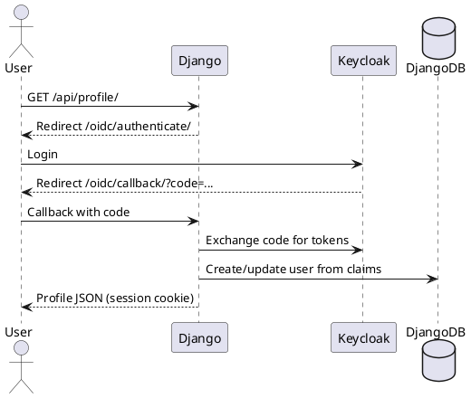

# Keycloak + Django Tutorial

A hands-on tutorial that integrates **Django** with **Keycloak** using the OpenID Connect (OIDC) authorization code flow. The project uses **two separate Docker Compose files** joined by a shared network, unit tests with documented scenarios, and a single startup script.

## Architecture

```
keycloak-django/
├── compose/
│   ├── keycloak.yml      # Keycloak + dedicated PostgreSQL
│   └── django.yml        # Django app + dedicated PostgreSQL
├── keycloak/
│   └── realm-export.json # Pre-configured realm, users, OIDC client
├── django_app/           # Django project with mozilla-django-oidc
├── docs/
│   ├── TEST_SCENARIOS.md
│   └── diagrams/django-keycloak-flow.puml
├── start.sh              # Start databases + both services
└── stop.sh               # Tear down everything
```

### Why two Compose files?

| Stack | File | Services | Purpose |
|-------|------|----------|---------|
| Identity | `compose/keycloak.yml` | `keycloak`, `keycloak-db` | OIDC provider, realm, users |
| Application | `compose/django.yml` | `django`, `django-db` | Web app, session, local user mirror |

Both stacks attach to the shared Docker network `keycloak-django-network`. Django reaches Keycloak internally at `http://keycloak:8080`, while your browser uses `http://localhost:8080`.

## Prerequisites

- Docker Engine 24+
- Docker Compose v2 plugin
- Python 3.12+ (for local unit tests only)

## Quick start

```bash
chmod +x start.sh stop.sh

# If port 8080 is already in use (e.g. another Keycloak instance):
cp .env.example .env   # uses KEYCLOAK_HTTP_PORT=8180

./start.sh
```

Then open:

| URL | Credentials |
|-----|-------------|
| Django home | http://localhost:8000/ |
| Keycloak admin | http://localhost:8080/admin/ — `admin` / `admin` |
| Demo user | `demo` / `demo` |
| Admin user | `admin` / `admin` |

Stop all services:

```bash
./stop.sh
```

## How Django uses Keycloak

Django acts as an **OIDC Relying Party (RP)**. Keycloak is the **Identity Provider (IdP)**.

1. User hits a protected route (`/api/profile/`).
2. Django redirects to Keycloak login (`/oidc/authenticate/`).
3. After login, Keycloak redirects back to Django with an authorization code.
4. Django exchanges the code for tokens at Keycloak's token endpoint.
5. Claims are mapped to a Django user via `KeycloakOIDCAuthenticationBackend`.
6. Django stores the session cookie; subsequent requests are authenticated locally.

### PlantUML sequence diagram

Render the diagram with any PlantUML viewer, or paste the contents of [`docs/diagrams/django-keycloak-flow.puml`](docs/diagrams/django-keycloak-flow.puml) into [plantuml.com/plantuml](https://www.plantuml.com/plantuml/uml/).



See the full diagram in [`docs/diagrams/django-keycloak-flow.puml`](docs/diagrams/django-keycloak-flow.puml).

## Keycloak configuration

The realm `tutorial` is imported automatically from [`keycloak/realm-export.json`](keycloak/realm-export.json).

| Setting | Value |
|---------|-------|
| Realm | `tutorial` |
| OIDC client ID | `django-app` |
| Client secret | `django-app-secret` |
| Redirect URI | `http://localhost:8000/oidc/callback/` |
| Grant type | Authorization Code |

### Key OIDC endpoints

| Endpoint | URL |
|----------|-----|
| Authorization | `http://localhost:8080/realms/tutorial/protocol/openid-connect/auth` |
| Token | `http://keycloak:8080/realms/tutorial/protocol/openid-connect/token` |
| Userinfo | `http://keycloak:8080/realms/tutorial/protocol/openid-connect/userinfo` |
| JWKS | `http://keycloak:8080/realms/tutorial/protocol/openid-connect/certs` |
| Logout | `http://localhost:8080/realms/tutorial/protocol/openid-connect/logout` |

> **Note:** Browser-facing URLs use `localhost`. Container-to-container calls use the Docker service name `keycloak`.

## Django configuration

Key settings live in [`django_app/config/settings.py`](django_app/config/settings.py):

- **Library:** [`mozilla-django-oidc`](https://github.com/mozilla/mozilla-django-oidc)
- **Auth backend:** `auth_app.backends.KeycloakOIDCAuthenticationBackend`
- **Role mapping:** Keycloak realm role `admin` sets `User.is_staff = True`

### Application routes

| Route | Auth required | Description |
|-------|---------------|-------------|
| `/` | No | Home page with login/logout links |
| `/health/` | No | Health check for Docker |
| `/oidc/authenticate/` | No | Starts OIDC login |
| `/oidc/callback/` | No | Keycloak redirect target |
| `/oidc/logout/` | No | Logout from Django + Keycloak |
| `/api/profile/` | Yes | JSON profile of current user |
| `/api/admin-only/` | Yes (staff) | Example admin-only endpoint |

## Unit tests

Tests live in [`django_app/auth_app/tests/test_auth.py`](django_app/auth_app/tests/test_auth.py). They mock Keycloak endpoints so they run without Docker.

```bash
cd django_app
python -m venv .venv
source .venv/bin/activate
pip install -r requirements.txt
python manage.py test auth_app.tests -v 2
```

### Test scenarios

Full scenario documentation: [`docs/TEST_SCENARIOS.md`](docs/TEST_SCENARIOS.md)

| ID | Scenario | What it proves |
|----|----------|----------------|
| S1 | Health endpoint | Public `/health/` returns OK |
| S2 | Protected profile | Anonymous users are redirected to login |
| S3 | Admin guard | Non-staff users cannot access `/api/admin-only/` |
| S4 | Staff access | Staff users can access admin route |
| S5 | User provisioning | Keycloak claims create Django users |
| S6 | Role mapping | `admin` realm role maps to `is_staff` |
| S7 | Profile sync | User fields update from new claims |
| S8 | OIDC redirect | Login initiates Keycloak authorization |
| S9 | Profile API | Authenticated users receive profile JSON |

## Walkthrough: first login

1. Run `./start.sh` and wait until both stacks are healthy.
2. Visit http://localhost:8000/ and click **Login with Keycloak**.
3. Sign in as `demo` / `demo`.
4. You are redirected to `/api/profile/` with JSON like:

```json
{
  "username": "demo",
  "email": "demo@example.com",
  "first_name": "Demo",
  "last_name": "User",
  "is_staff": false,
  "roles": ["user"]
}
```

5. Logout, then login as `admin` / `admin` and open `/api/admin-only/`.

## Troubleshooting

| Problem | Fix |
|---------|-----|
| Port 8080 already in use | Run `KEYCLOAK_HTTP_PORT=8180 ./start.sh` or copy `.env.example` to `.env` |
| `start.sh` hangs on Keycloak | First boot imports the realm; wait up to 2 minutes |
| Redirect URI mismatch | Ensure Keycloak client redirect URI matches `http://localhost:8000/oidc/callback/` |
| `401` on `/oidc/callback/` userinfo | Fixed in backend: claims come from the ID token (issuer hostname mismatch with internal `keycloak:8080`) |
| Django cannot reach Keycloak | Confirm both stacks share `keycloak-django-network` |
| Invalid client | Client secret must be `django-app-secret` in both realm export and Django env |

## Production considerations

This tutorial uses development defaults. Before production:

- Replace dev secrets (`DJANGO_SECRET_KEY`, client secret, DB passwords)
- Enable HTTPS and set `KC_HOSTNAME_STRICT=true`
- Use `start` instead of `start-dev` for Keycloak
- Store secrets in a vault or orchestrator secrets, not Compose env files
- Restrict Keycloak client redirect URIs to your real domain
- Set `DJANGO_DEBUG=false` and configure proper `ALLOWED_HOSTS`

## References

- [Keycloak documentation](https://www.keycloak.org/documentation)
- [mozilla-django-oidc](https://github.com/mozilla/mozilla-django-oidc)
- [OpenID Connect Core 1.0](https://openid.net/specs/openid-connect-core-1_0.html)
